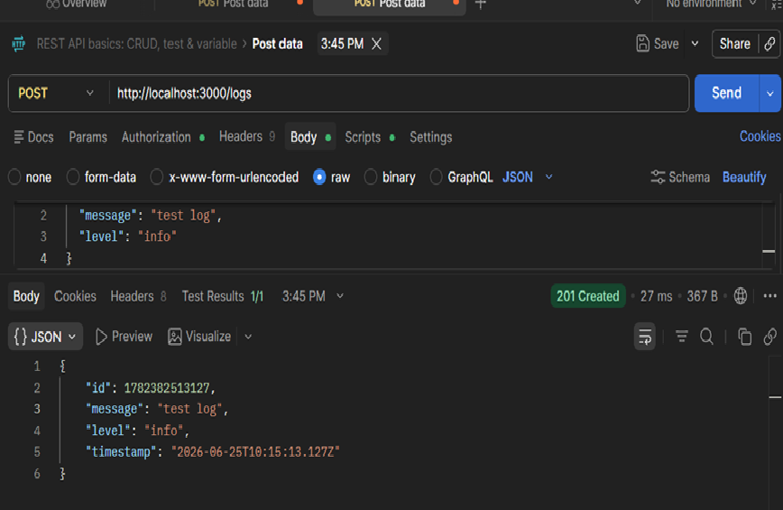

## Logging Middleware

## Setup
```bash
npm install
node src/app.js
```

## Running
Server runs on port 3000

## API Endpoints

### GET /logs
Returns all logs

### POST /logs
Creates a new log entry

Request Body:
```json
{
  "message": "your log message",
  "level": "info"
}
```

## Screenshots


### POST /logs


## Middleware
Every request is automatically logged with:
- Timestamp
- HTTP Method
- URL