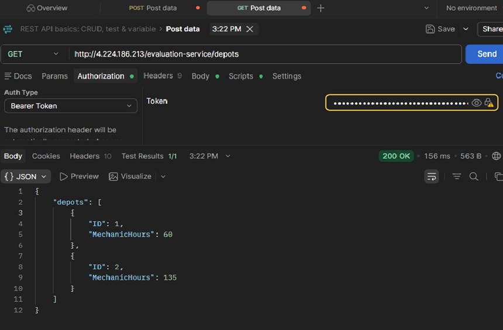
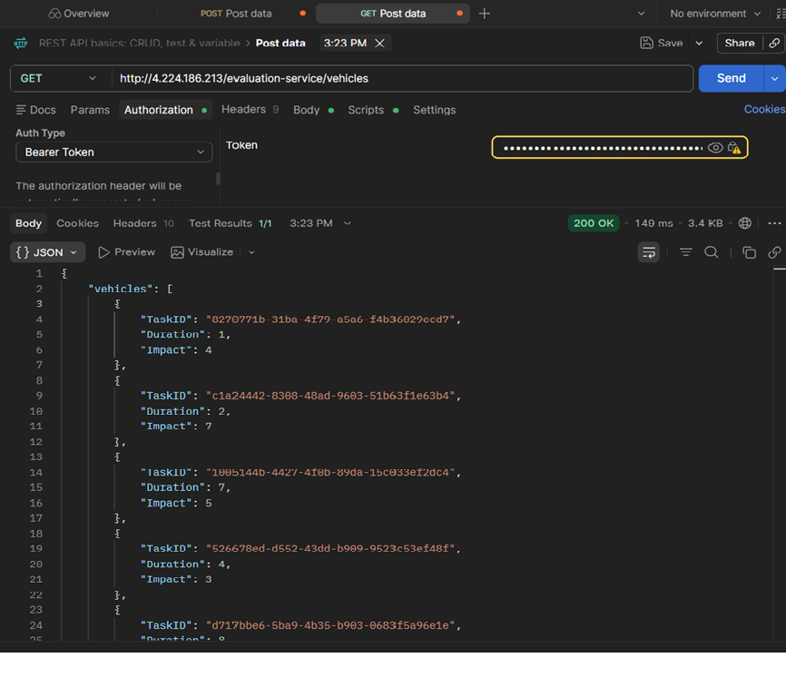

# Vehicle Scheduler BE

## Running the Server
```bash
node index.js
```

## API Endpoints

### GET /schedule/:depotId
Returns max impact schedule for a depot

## Screenshots

### Depot API


### Vehicles API
